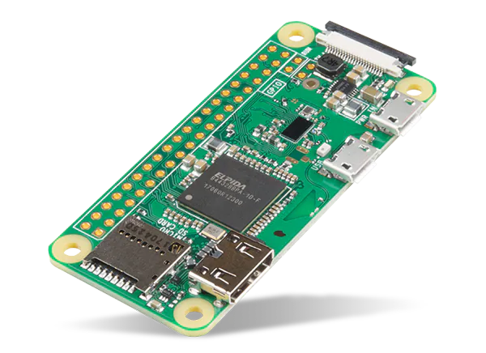
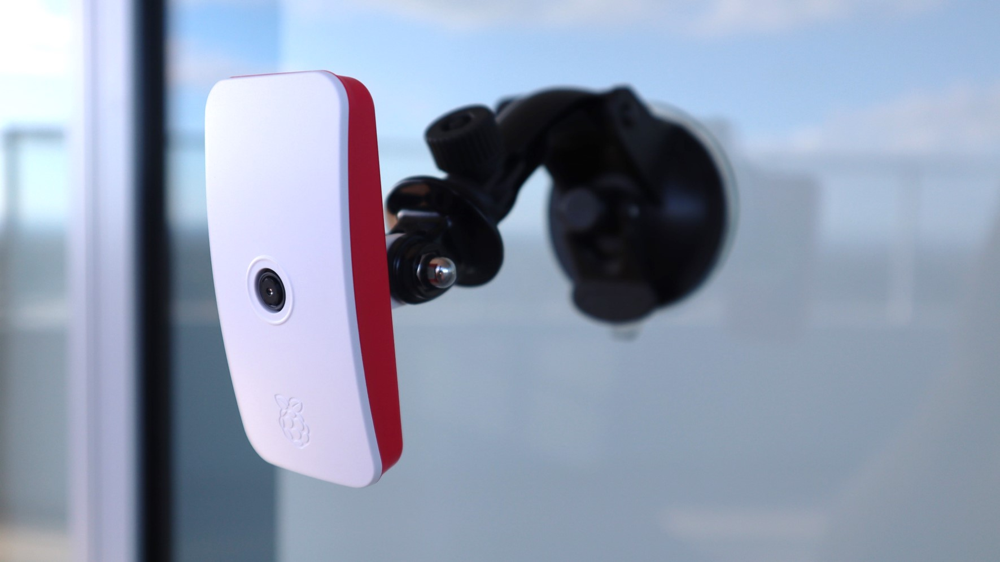

# Raspberry-pi zero security camera app

The main idea of this application it's create an easy way to setup a security camera (use case for vehicles oriented), storing video data while driving and make it accessible thorough your smartphone, also interconnect and sync more cameras to cover additional points of view.

### Required hardware:

 

- Raspberry PI Zero W or higher (W-2 / any model B with Wireless/Bluetooth capabilities).
- Raspberry PI Camera Module 2/3/High-Quality with MIPI CSI connector (recomended) or any USB camera.
- Android or iPhone device.
- Wi-Fi Internet connection for the initial setup.

### Mobile application capabilities:

- Connect via SSH over Bluetooth to the Raspberry-Pi and automatically install the required software.
- Configure raspberry-pi zero storage options.
- Create video clips and store it into the mobile device.
- Create video backups and share or upload to cloud.
- Stream camera input from server (network required).

### Offline mode capabilities:

- Record last 3 hours of camera input (by default).
- Stream last minute of camera input automatically to the mobile device.
- Allow connection from multiple mobile devices.

### Network mode capabilities:

- Stream real-time camera input to a server.
- Store last day of camera input (by default).

### Nice to have:

- Identify vehicle accident detection and record plates.
- Built-in auto-rechargeable battery system to keep recording for several days, and store clips of movements around the card on night hours.
- Send alerts to the mobile when movement it's detected on night hours.
